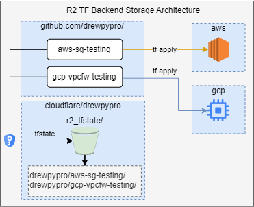
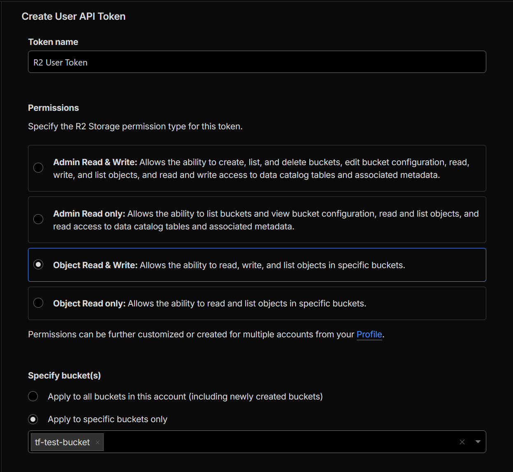
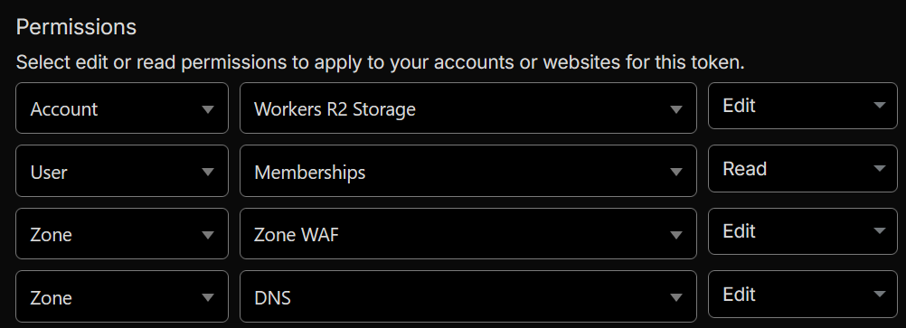
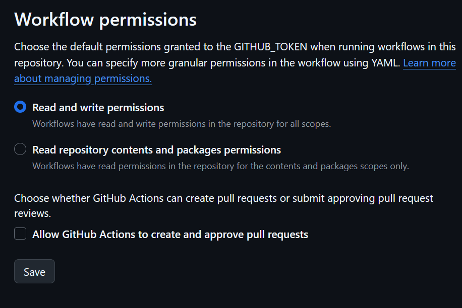

# Cloudflare R2 TF Backend

- Test cloudflare r2 object storage as a public cloud terraform state backend when using github actions for an IaC pipeline.
- Building the R2 storage and API tokens must be done manually in the portal (or in a separate pipeline)

# TOC
- [Prerequisites](#prerequisites)
- [Getting Started](#getting-started)
- [Creating an R2 Bucket](#creating-an-r2-bucket)
- [API Tokens and IAM](#api-tokens-and-iam)
    - [Cloudflare R2 API Token](#cloudflare-r2-api-token)
    - [Cloudflare API Token](#cloudflare-api-token)
    - [AWS IAM and Permissions](#aws-iam-and-permissions)
- [Using this Repo](#using-this-repo)
- [Costs](#costs)
- [References](#references)


# Prerequisites 
- Must go to R2 and enable billing for R2 service.
- Must create an R2 Storage bucket.
- Should have public cloud provider resources to test with
    - For this test I used AWS account with the default vpc and create AWS SG's (which is free)
    - AWS account ID, IAM Policy, Roles, etc. required to build the AWS SG. 
    - You could generate terraform code that builds something in the runner and stores to R2 if you don't have a public cloud account to test with.
- Must have a cloudflare account, a publicly registered domain already configured as well
    - Cloudflare API tokens can be configured to restrict access to specific source IPs.
    - You can use api.github.com/meta to retrieve all the ipv4 and ipv6 subnets and configure them as a condition for your cloudflare API keys.

# Getting Started

## Creating an R2 Bucket
1. In Cloudflare go to Account Home->Storage & databases->R2 object storage->Overview
2. Create Bucket, provide it a bucket name (to be used in the $BUCKET_NAME variable), choose "wnam" location (if you change it make sure to change it in the [providers.tf](providers.tf#L19)) and select **Standard** default storage class. 
> [!NOTE]
> You may need to accept the purchasing agreement here if necessary.

## API Tokens and IAM

### **[Cloudflare R2 API Token](https://developers.cloudflare.com/r2/api/tokens/)** 
- **Access** and **Secret Key** for the TF provider to write tfstate to the R2 backend.
- When [building in the console](https://developers.cloudflare.com/r2/api/tokens/) use the [permissions](https://developers.cloudflare.com/r2/api/tokens/#permissions) **Object Read & Write**.
    - 
- When [building via the API](https://developers.cloudflare.com/r2/api/tokens/#create-api-tokens-via-api) use the ```Workers R2 Storage Bucket Item Write``` [permission group](https://developers.cloudflare.com/r2/api/tokens/#permissions)

### **[Cloudflare API Token](https://developers.cloudflare.com/fundamentals/api/get-started/create-token/)**(optional) 
- Need this to build R2 Storage programatically (add DNS and WAF if you like)
- This repo assumes you build R2 manually via the console.
- It's possible to create the API tokens automatically using the API or via TF but consider the implications of secrets management first.
- Use these permissions if building R2, DNS and WAF
    - 

## AWS IAM and Permissions
- For my testing I created an IAM User for my repo (IAM->Access Management->Users)
- Go to Security credentials tab, select **Create access key**, **Other** and store ```AWS_ACCESS_KEY_ID``` and ```AWS_SECRET_ACCESS_KEY```
- <details>
    <summary>Used this minimal inline policy</summary>

        ```json
        {
          "Version": "2012-10-17",
          "Statement": [
            {
              "Effect": "Allow",
              "Action": [
                "ec2:CreateSecurityGroup",
                "ec2:DeleteSecurityGroup",
                "ec2:DescribeSecurityGroups",
                "ec2:RevokeSecurityGroupEgress",
                "ec2:RevokeSecurityGroupIngress",
                "ec2:DescribeNetworkInterfaces",
                "ec2:DescribeVpcAttribute",
                "ec2:DescribeVpcs",
                "ec2:CreateTags",
                "ec2:DeleteTags"
              ],
              "Resource": "*"
            }
          ]
        }
        ```

    </details>

## [Git Actions](.github/workflows/terraform-build.yaml)
- [Env Vars](.github/workflows/terraform-build.yaml#L11) are declared using github-secrets
- Git runner docker container image is set to ```ghcr.io/drewpypro/kube-aws-istio:latest```
- **Steps**:
    1. [Checkout repo](.github/workflows/terraform-build.yaml#L27) - clone latest HEAD version of repo on runner. 
    2. [Verify Backend](.github/workflows/terraform-build.yaml#L30) - tests the r2 provider backend, put a file in your bucket to see it displayed in the runner. 
    2. [terraform init](.github/workflows/terraform-build.yaml#L43) - Initialize terraform (and the backend)
    3. [terraform plan](.github/workflows/terraform-build.yaml#L52) - Plan resource build
    4. [terraform apply](.github/workflows/terraform-build.yaml#L56) - Apply resources

# Using this Repo
- fork or clone this repo into your personal git repo ```https://github.com/yourprofile/cloudflare-r2-tf-backend```
- Go to ```https://github.com/yourprofile/cloudflare-r2-tf-backend/settings/actions``` and enable **Read and write permissions** under the Workflow permissions section and save. 
    
- set your repository secrets in github ```https://github.com/yourprofile/cloudflare-r2-tf-backend/settings/secrets/actions``` as described in [#Getting Started](#getting-started)
    - ```AWS_ACCESS_KEY_ID``` & ```AWS_SECRET_ACCESS_KEY```: AWS access key and secret for building AWS SG's.
    - ```BUCKET_ACCESS_KEY_ID``` & ```BUCKET_SECRET_ACCESS_KEY```:  R2 API access/secret keys used to read/write to the R2 storage backend. Generated when creating the [Cloudflare R2 API Token](#cloudflare-r2-api-token).
    - ```BUCKET_ENDPOINT```: ```https://<your-account-id>.r2.cloudflarestorage.com``` which should be provided to you in the R2 dashboard. 
    - ```BUCKET_KEY```: This is the file that will be created by the tf provider. You can do something like ```cloudflare-r2-tf-backend/terraform.tfstate```
    - ```BUCKET_NAME```: Bucket name you provided in the [Creating an R2 Bucket](#creating-an-r2-bucket) step.
    -  **If building buckets programatically (optional)**:
        - ```CLOUDFLARE_API_TOKEN```: An API token created to build Cloudflare R2, DNS and WAF resources as described in the [Cloudflare API Token](#cloudflare-api-token) section.
        - ```CLOUDFLARE_ACCOUNT_ID``` & ```CLOUDFLARE_ZONE_ID```: Cloudflare Account ID and zone required for DNS and WAF resources.

# Costs 
- **[Cloudflare R2 Free tier](https://developers.cloudflare.com/r2/pricing/#free-tier)** - Free if you stay within the limits of cloudflare R2 free tier.

    | Component | Free Amount | Rationale |
    | --- | --- | --- |
    | Storage | 10 GB | Tfstate files are usually KB to MB which should be well below the 10GB threshold |
    | Class A (writes, lists) | 1 million/month | Should be perfect for personal deployments or lab testing |
    | Class B (reads) | 10 million/month | TF reads tfstate when plans/applys/destroys occur but this should be well within the threshold of 10 million/month |
- **AWS** - Free when using default vpc and creating security-groups and security-group-rules within quota limits.
    - [There is no additional charge for using security-groups.](https://docs.aws.amazon.com/vpc/latest/userguide/vpc-security-groups.html)
    - [There's no additional charge for using a VPC.](https://docs.aws.amazon.com/vpc/latest/userguide/what-is-amazon-vpc.html#pricing)

# References
- [Terraform Cloudflare R2](https://registry.terraform.io/providers/cloudflare/cloudflare/latest/docs/resources/r2_bucket)
- [Terraform Cloudflare API Token](https://registry.terraform.io/providers/cloudflare/cloudflare/latest/docs/resources/api_token)
- [Terraform Cloudflare Ruleset](https://registry.terraform.io/providers/cloudflare/cloudflare/latest/docs/resources/ruleset)
- [Terraform Cloudflare DNS](https://registry.terraform.io/providers/cloudflare/cloudflare/latest/docs/resources/dns_record)
- [Create new API token in Cloudflare console](https://developers.cloudflare.com/fundamentals/api/get-started/create-token/)
- [Cloudflare R2 API Tokens](https://developers.cloudflare.com/r2/api/tokens/)
    - [Cloudflare R2 API Permissions](https://developers.cloudflare.com/r2/api/tokens/#permissions)
    - [Create Cloudflare R2 API tokens via API](https://developers.cloudflare.com/r2/api/tokens/#create-api-tokens-via-api)
- [Cloudflare R2 Remote State Backend](https://developers.cloudflare.com/terraform/advanced-topics/remote-backend/)
- [Cloudflare Create a token](https://developers.cloudflare.com/fundamentals/api/get-started/create-token/)
- [Cloudflare R2 Pricing tier](https://developers.cloudflare.com/r2/pricing/#free-tier)
- [AWS VPC Pricing](https://docs.aws.amazon.com/vpc/latest/userguide/what-is-amazon-vpc.html#pricing)
- [AWS VPC Security Groups Pricing](https://docs.aws.amazon.com/vpc/latest/userguide/vpc-security-groups.html)
